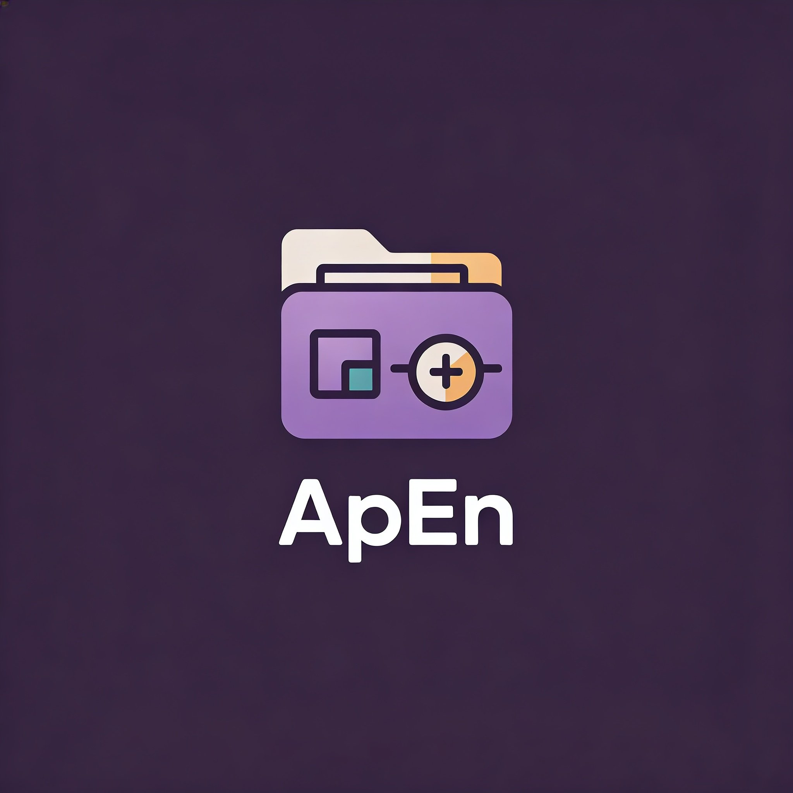

<div align="center">



# ApEn — App & File Environment

### Hub de productividad personal para Windows · Sin instalación · Sin cuenta

*Launcher de apps · Organizador de archivos · Etiquetas · Favoritos · Temas*

---


</div>

---

## ¿Qué es ApEn?

**ApEn** es una aplicación de escritorio para Windows que funciona como hub de productividad personal. Lanza tus apps favoritas con un clic y organiza carpetas de archivos automáticamente por tipo. Funciona completamente offline — sin cuentas, sin servidores, sin internet.

---

## Características

| | Función | Descripción |
|:---:|---|---|
| 🚀 | **App Launcher** | Agrega tus aplicaciones y lánzalas con un clic |
| ★ | **Favoritos** | Marca apps como favoritas para tenerlas siempre arriba |
| ✎ | **Renombrar** | Ponle el nombre que quieras dentro de ApEn |
| 🏷️ | **Etiquetas** | Crea etiquetas con colores personalizados y filtra por ellas |
| 📂 | **File Organizer** | Clasifica archivos de una carpeta en subcarpetas por tipo |
| 🌗 | **Tema claro/oscuro** | Cambia entre temas con un clic |
| 💾 | **Offline** | Configuración guardada en JSON local |

---

## ⬇️ Descarga para usuarios

> No necesitas instalar .NET ni ningún programa adicional.

1. Ve a [**Releases**](https://github.com/JuanEstebanHerreraH/ApEn---App-File-Environment/releases)
2. Descarga **`ApEn-v1.0-win-x64.zip`**
3. Descomprime en cualquier lugar y ejecuta **`ApEn.exe`**

### ⚠️ SmartScreen de Windows

Si Windows muestra *"aplicación desconocida"* → clic en **"Más información" → "Ejecutar de todas formas"**. ApEn no tiene firma de código de pago, pero el código fuente es 100% público y verificable aquí en GitHub.

### 🔴 Falso positivo de antivirus (Malwarebytes y otros)

Algunos antivirus como Malwarebytes pueden marcar el ejecutable como `MachineLearning/Anomalous`. **ApEn no es malware.**

**¿Por qué ocurre?**
Los ejecutables compilados localmente sin firma de distribución comercial disparan heurísticos de machine learning en algunos antivirus. Es un falso positivo documentado que afecta a muchas aplicaciones de código abierto sin firma de código.

**Solución:**
- Agrega `ApEn.exe` a las exclusiones de tu antivirus
- Verifica el código fuente directamente aquí en el repositorio — es completamente público
- Si quieres mayor confianza, compílalo tú mismo desde el código fuente (ver sección de desarrolladores)

---

## Cómo usar ApEn

### Launcher

```
1. Clic en "+ App" → selecciona un .exe desde tu PC
2. Clic en ▶ para ejecutar la app
3. Clic en ★ para marcarla como favorita
4. Panel derecho: ✎ renombrar · asignar etiquetas
5. Clic en "🏷 Filtrar" para filtrar la lista por etiquetas
```

### File Organizer

```
1. Clic en "Examinar..." → elige la carpeta
2. Clic en "⚡ Organizar"
```

| Subcarpeta | Extensiones |
|---|---|
| `PDF/` | .pdf |
| `Images/` | .jpg .png .gif .bmp .webp .svg... |
| `Videos/` | .mp4 .mkv .avi .mov .wmv... |
| `Audio/` | .mp3 .wav .flac .aac .ogg... |
| `Docs/` | .docx .xlsx .pptx .txt .csv... |
| `Zips/` | .zip .rar .7z .tar .gz... |
| `Others/` | Todo lo demás |

> Los archivos ya clasificados en subcarpetas no se duplican.

---

## Para desarrolladores

### Requisitos

| Herramienta | Versión | Link |
|---|---|---|
| **.NET 8 SDK** | 8.x | https://dotnet.microsoft.com/download/dotnet/8.0 |
| **Windows** | 10 / 11 (64-bit) | — |

### Ejecutar en modo desarrollo

```cmd
git clone https://github.com/JuanEstebanHerreraH/ApEn---App-File-Environment.git
cd ApEn---App-File-Environment\ApEn
dotnet build
dotnet run
```

### Generar ejecutable para distribución

```cmd
dotnet publish -c Release -r win-x64 --self-contained true -p:PublishSingleFile=true -o publish
cd publish
powershell Compress-Archive -Path ApEn.exe -DestinationPath ..\ApEn-v1.0-win-x64.zip
```

El ZIP resultante (~70 MB) incluye el runtime de .NET — el usuario final no necesita instalar nada.

---

## Estructura del proyecto

```
ApEn/
├── Assets/                    ← Logo e ícono
├── Commands/RelayCommand.cs   ← ICommand para MVVM
├── Converters/                ← Value converters para XAML
├── Data/config.json           ← Configuración local (ignorada en git)
├── Models/                    ← AppModel, TagModel, ConfigModel
├── Services/                  ← Config, FileOrganizer, Icon, Theme
├── Themes/                    ← DarkTheme.xaml / LightTheme.xaml
├── ViewModels/                ← BaseViewModel, AppItemVM, MainVM
├── Views/                     ← MainWindow, TagDialog
├── App.xaml/.cs               ← Entry point + estilos globales
└── ApEn.csproj                ← .NET 8 WPF
```

---

<div align="center">

Construido con C# y WPF · Windows 10/11 · .NET 8

</div>
